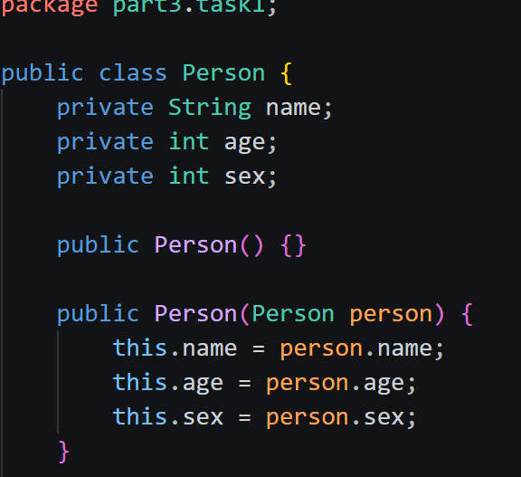
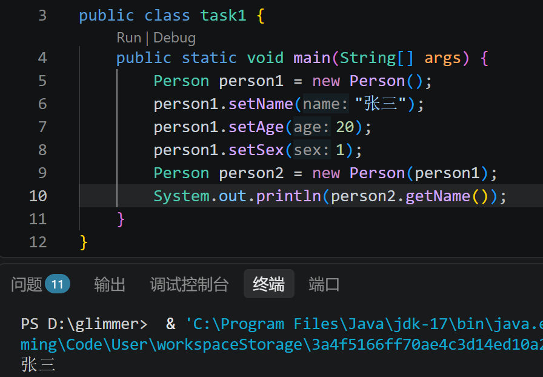

# task1
- #### 为 Person 类添加构造方法，并实现“复制对象”的效果。

- #### 请说明你的构造方法是否用到了 this，如果用了，它在这里起什么作用。
用到了，它在这里的作用是指向当前创建的对象，方便赋值。
- #### 在 main 方法中创建至少一个 Person 对象，并给对象赋值。

- #### 请用自己的话解释“类”和“对象”的关系。
类是对某种事物的定义，包括行为（函数）和属性（成员变量）等。
对象是根据类的定义创建的一个实例，具有自己的属性，并且能调用在类中定义的函数。