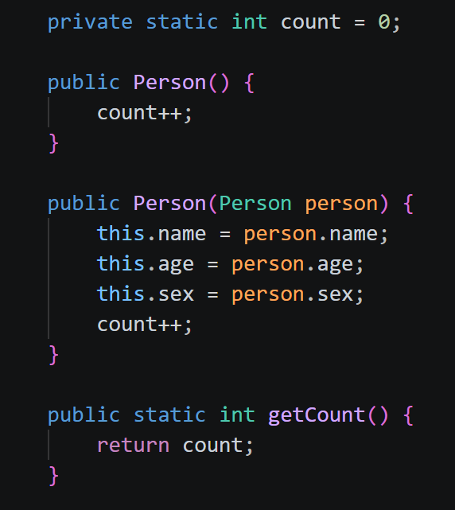

# task2
- #### 为字段和方法补上你认为合适的访问修饰符。
所有成员变量都用的private访问修饰符。
方法都用的public访问修饰符。
- #### 尝试在以下位置访问它们，并总结访问范围：
  - 当前类内部：不管是private还是public都可以访问。
  - 同一个包下的其他类：public可以访问，private不行。
  - 不同包下的类：同上。
- #### 说明 public、private、protected、默认访问权限分别代表什么。
  - public:不管什么情况都能访问。
  - private:只有类内部能访问。
  - protected:同一个类，同一个包可以访问，不同包的子类的实例可以调用从基类继承的protected函数，但不能调用基类实例的protected函数。
  - 默认访问权限:同一个类，同一个包可以访问。
- #### 给 Person 增加一个静态变量，例如“当前已创建对象数量”。

- #### 再增加一个静态方法，并解释：
  1. ##### 为什么静态方法可以直接通过类名调用:
  因为静态方法属于类本身，不依赖某个具体的对象，所以可以通过类名调用。

  2. ##### 为什么实例方法通常需要先创建对象：
  实例方法属于某个具体的对象，并且执行过程中可能访问对象的成员变量，所以需要先创建对象再调用。