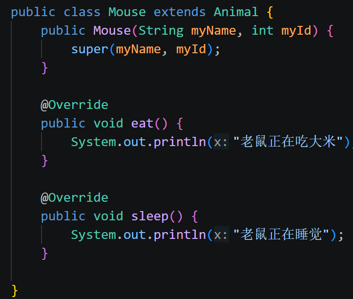
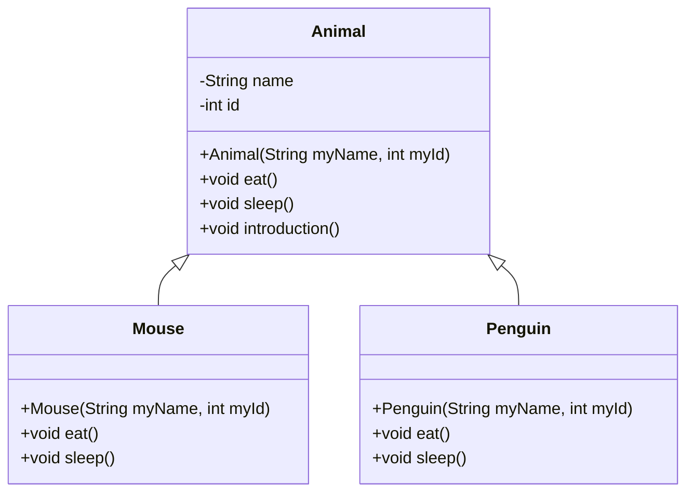

# task3
## ans
- ##### 创建 Penguin 和 Mouse 两个子类，并继承 Animal。
- ##### 使用 super 调用父类构造方法。
- ##### 尝试在子类中重写至少一个父类方法，体现不同对象的行为差异。

- ##### 解释：为什么 Java 不支持类的多继承？
java不支持类的多继承主要是为了避免多继承可能产生的复杂性和冲突。
比如菱形继承，有一个类A包含一个int类型的id变量和一个自我介绍方法，又有两个类B、C都继承了A，它们分别重写了A的自我介绍方法，分别输出B、C，如果D同时继承B、C，当调用D的自我介绍方法时，就会不知道应该调用B的方法还是C的方法，同时因为B和C都有id变量，D继承id变量时就会发生字段冲突，不知道继承谁的。
如果要解决这些问题，java必须制定更复杂的规则，会让代码更难理解，因此java干脆直接不支持类的多继承，并且通过接口的多实现来弥补这部分。

##### 类图思路
