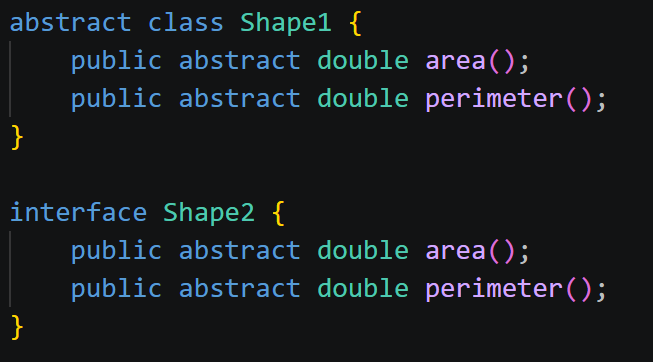
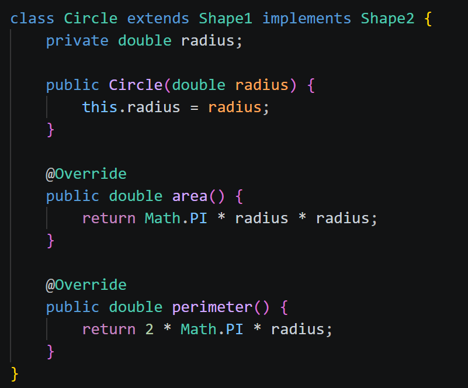
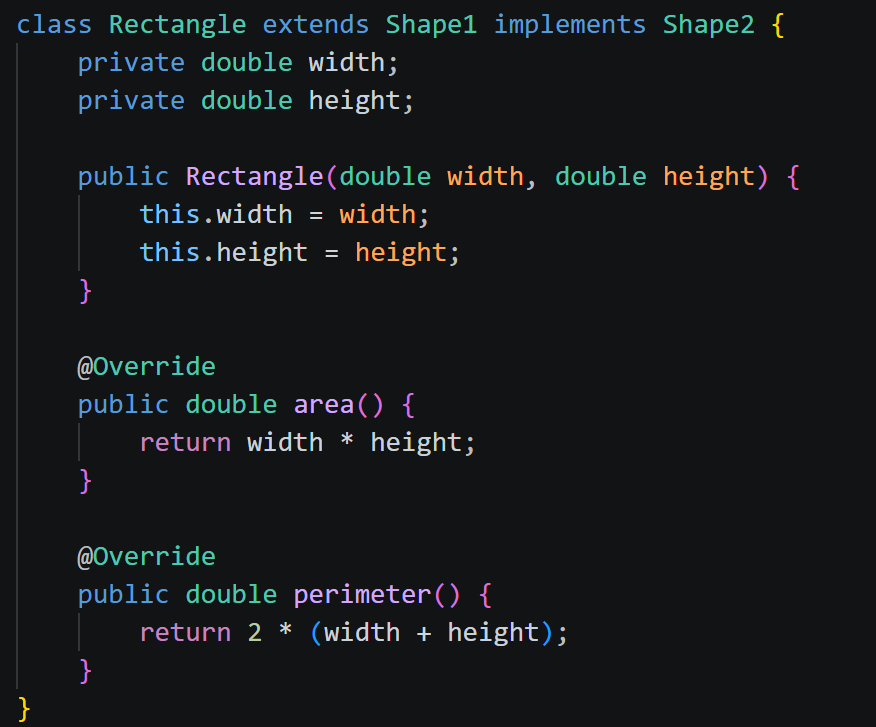
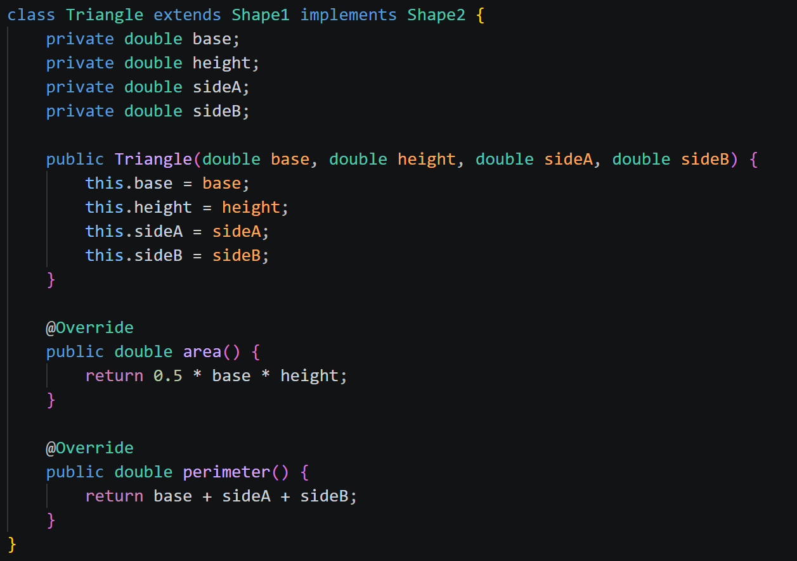
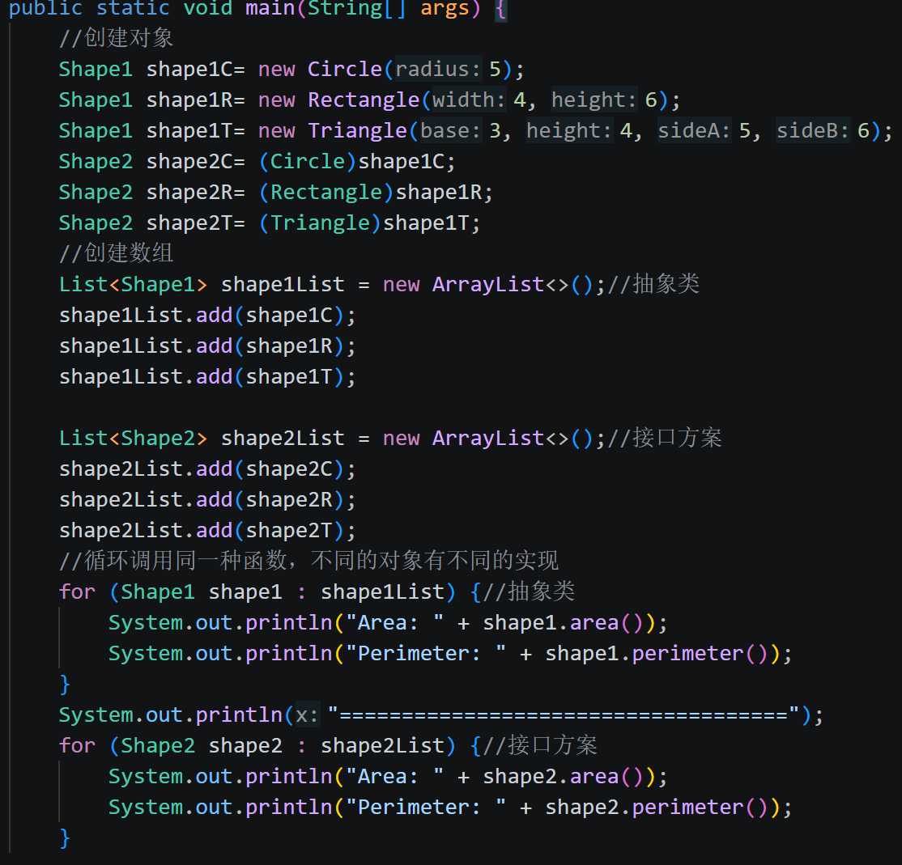
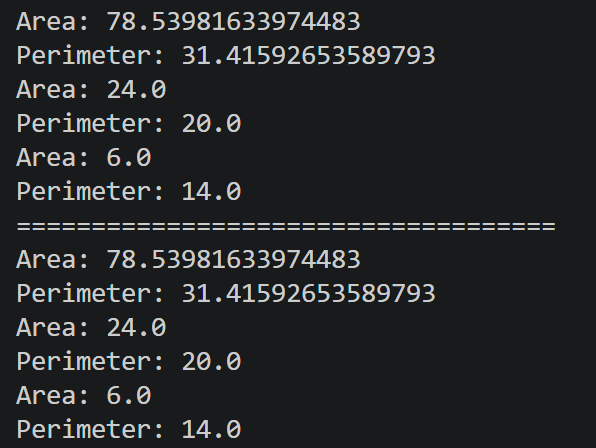
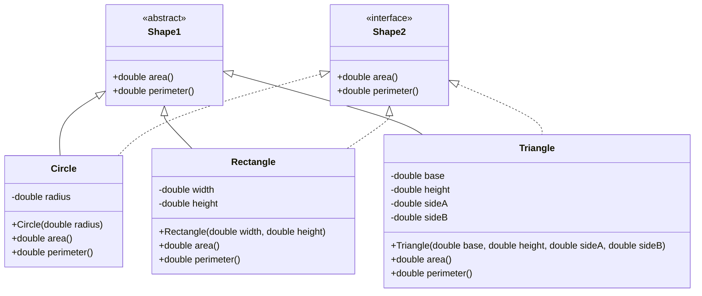

# task4
## ans
- #### 至少用一种面向对象方式完成。你可以选择：抽象类方案、接口方案

- #### 如果两种方案都完成，请说明它们各自适合什么场景。
抽象类：适合一类有许多共同的属性和行为的事物，它们本质上可以划分为同一种事物。
接口方案：适合想让一些不同类型的类拥有某种特定的能力或者方法的情况，通过接口，可以让它们在同一种规范下实现一种功能，它们可以不是相似的事物，只是有同样的能力。
- #### 如果你已经理解了多态，可以进一步演示：把多种图形放进同一个集合里，循环调用它们的面积或周长方法。

- #### 类图设计

- #### 设计时的取舍
每个具体类都同时继承一个Shape抽象类和实现一个Shape接口，提高了代码的复用性？能同时展示两个方案。